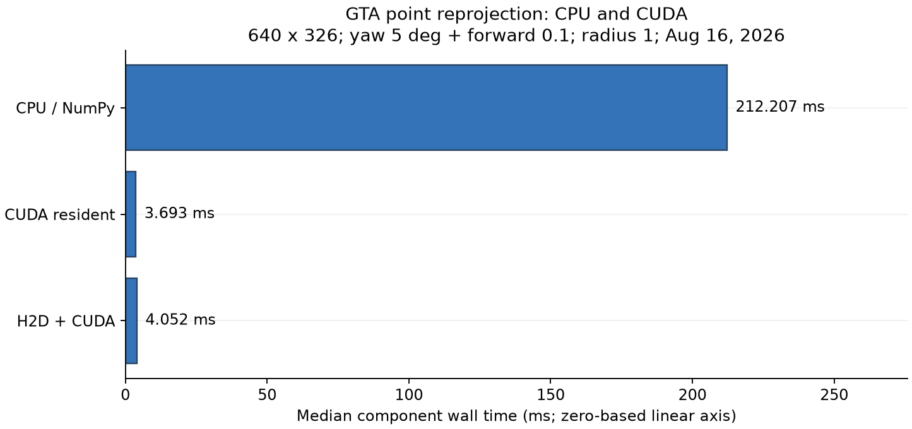
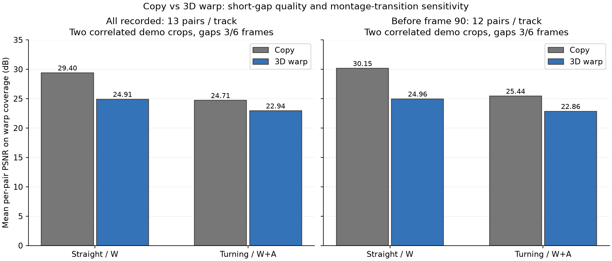
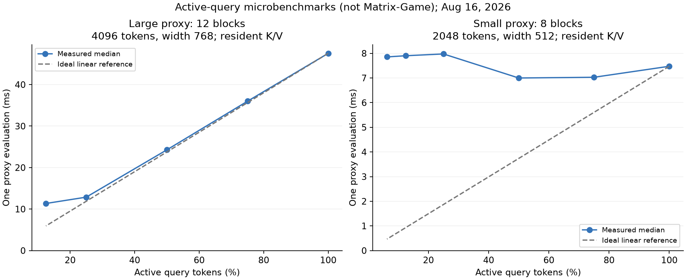

# 3D-light-model

探索重投影之前的几何信息（深度，视角，移动参数等）。

面向交互式视频世界模型的轻量 3D 几何与重投影加速实验。

**当前主线：Geometry-Aligned Latent 3D。** 冻结 Matrix-Game/Wan VAE 后，M1 直接从 `[B,16,44,80]` 空间 latent 预测同网格的 depth/point map、valid mask、motion-conditioned confidence 和相机元数据，并以 latent reprojection 质量评价几何。MoGe-3 目前只作为离线伪标签来源和参照上界；真实 GT 跨场景证据与端到端加速仍在补齐。

本仓库保存 2026-08-16 在 RTX 4060 Laptop 8 GB 上完成的实验，以及 2026-08-28 的结果整理和方法审计。目标是判断：在 Matrix-Game 类自回归游戏生成中，能否用几何复用减少昂贵的生成计算，同时控制画质和交互延迟。

2026-08-28 新增：[MoGe-3 参照选择与 H100 实验报告](docs/MOGE3_REFERENCE_AND_H100_PLAN.md)。后续论文叙事建议以 MoGe-3 作为高质量几何参照和离线教师，MoGe-2 Small / Copy / Homography 作为必须击败的实时基线。

English: A reproducible geometry/reprojection feasibility study for accelerating interactive video world models. The repository contains measured geometry and CUDA-warp components, offline target-frame diagnostics, and explicitly labeled DiT-like proxy accounting. It is **not** a complete game generator or a demonstrated end-to-end acceleration system.

## 已完成什么

- 单张 RGB 提取点图、深度、法线、有效区域和相机内参，无需先在线优化 3DGS。
- CPU 正确性原型与 CUDA z-buffer forward splat。
- 两种大小的 active-query Transformer 微基准，验证“少算 token 是否真的更快”。
- 官方 Matrix-Game 2 展示视频的两个 GTA 裁剪区域：59 个有效帧对、1 个失败帧对；比较 Copy 与 Warp。
- 原始数值记录、可重建图表、离线 Oracle 口径修正和保守耗时账本。

未完成：玩家输入到真实相机位姿、动态物体运动、可部署质量路由器、局部修复模型、latent/KV 一致性、真实 AR-DiT 集成与 action-to-photon 测量。

## 最重要的结果

### 几何信息能获得，但提取成本需要摊销

模型为 [MoGe-2 ViT-S Normal](https://huggingface.co/Ruicheng/moge-2-vits-normal)，输入最长边 640、1,200 个模型视觉 token。以下是模型驻留后的计时，不含首次下载、加载和结果导出。

| 输入 | 分辨率 | 几何推理中位数 | 几何有效像素 | CUDA Warp 中位数 |
|---|---:|---:|---:|---:|
| GTA driving | 640 × 326 | 58.606 ms | 96.30% | 3.693 ms |
| Temple Run | 640 × 405 | 59.302 ms | 49.55% | 2.620 ms |
| Universal street | 640 × 358 | 60.385 ms | 79.56% | 4.479 ms |

来源：[几何与计时汇总](results/audited/summary.json)。Warp 为 yaw 5°、前移 0.1 个预测尺度单位、3×3 splat；每个场景输入不同，不能只按耗时排名模型质量。

### CUDA 优化有效，不等于整个生成系统快了 57 倍

GTA 的 NumPy Warp 为 **212.207 ms**，CUDA 驻留路径为 **3.693 ms**，该组件约 **57.46×**；包含 CPU→GPU 传输为 **4.052 ms**。这是同一重投影任务的组件加速，不能当成 Matrix-Game 的加速倍率。



### Copy 是必须击败的强基线

在 3/6 帧间隔的原始样本上，Copy 的平均 PSNR 高于 Warp：直行 29.40 vs 24.91 dB；转向 24.71 vs 22.94 dB。两者都只在同一 Warp 覆盖区域计算。排除可能含视频拼接转场的样本后，这一方向不变。



这里的目标是展示视频中的未来 RGB，并不是引擎真值；位姿由目标帧辅助 PnP 得到，**仅用于离线评估**。上述结果不证明深度准确率或在线路由可行性。

### Token 减少不保证按比例提速

大代理的单次计算从 47.536 ms（100% Q）降到 12.877 ms（25% Q）；小代理没有稳定的缩放收益。两者都是随机权重、完整 K/V 预计算的结构测试，不是 Matrix-Game 权重推理。



**研究结论：**值得继续验证按需 `Copy / Warp / Repair / Regenerate`，但现有账本中几何分支尚未击败强 Copy 基线。重点应是证明几何的增量价值，而不仅仅是相对“每帧全部生成”的节省。

## 快速开始

### 只查看/重建已保存结果：不需要 GPU 或下载模型

在仓库根目录运行：

```bash
python -m venv .venv
# Windows PowerShell: .\.venv\Scripts\Activate.ps1
# Linux/macOS: source .venv/bin/activate
python -m pip install -r requirements-analysis.txt
python summarize_results.py
python -m unittest discover -s tests -v
python tools/verify_release.py
```

输出：[审核后的完整表格](results/audited/TABLES.md)、[汇总 JSON](results/audited/summary.json) 和 `assets/figures/`。无需执行 archive 中的历史脚本。

### 重新跑 RGB → 几何 → CUDA Warp

需要 NVIDIA GPU。实验环境为 Python 3.12.10、PyTorch 2.11.0+cu128；其他环境需自行验证。安装 CUDA 版 PyTorch，再按 [复现说明](docs/REPRODUCE.md) 获取锁定版本的依赖。

```bash
python -m pip install torch==2.11.0 torchvision==0.26.0 --index-url https://download.pytorch.org/whl/cu128
python -m pip install -r requirements.txt
python tools/setup_dependencies.py
python -m pip install -e third_party/MoGe
python geometry_provider.py --image third_party/Matrix-Game/Matrix-Game-2/demo_images/gta_drive/0000.png --output runs/gta --max-size 640 --num-tokens 1200 --warmup 1 --repeat 3
python reproject_torch.py --geometry runs/gta/geometry.npz --output runs/gta_yaw5 --yaw 5 --forward 0.10 --splat-radius 1 --warmup 10 --repeat 50
```

第一次几何推理会从 Hugging Face 下载模型。仓库不包含权重、完整视频、虚拟环境、第三方仓库或大体积 NPZ/PLY；普通使用不需要 Git LFS。

## 文档导航

| 文档 | 内容 |
|---|---|
| [实验结果](docs/EXPERIMENTS.md) | 实验设置、数值、负结果、样本与计时范围 |
| [方法与接口](docs/METHOD.md) | 3D 信息来源、坐标约定、重投影和离线评估 |
| [复现步骤](docs/REPRODUCE.md) | 环境、版本、数据裁剪、运行命令 |
| [结论与研究路线](docs/FINDINGS.md) | Fact / Inference / Hypothesis / Risk / Experiment |
| [发布审计](docs/AUDIT.md) | Oracle 命名、外推、转场风险及证据边界 |
| [MoGe-3 参照与 H100 计划](docs/MOGE3_REFERENCE_AND_H100_PLAN.md) | 是否以 MoGe-3 为参照、论文技术骨架、H100 实验矩阵 |
| [组会速览](docs/GROUP_MEETING.md) | 可以直接用于汇报的结论与下一步 |
| [第三方来源](THIRD_PARTY_NOTICES.md) | 代码、权重、展示视频与图像来源 |
| [贡献说明](CONTRIBUTING.md) | 新实验的记录要求 |
| [Latent 3D 审阅入口](docs/latent3d/README.md) | 当前方法、代码、协议和证据的统一索引 |
| [Latent 3D 结果边界](LATENT3D_RESULTS.md) | Fact / Negative Result / Hypothesis |
| [真实数据集计划](docs/latent3d/REAL_DATASETS.md) | GT depth、pose、K 数据集的适配度与实验顺序 |

## 目录

```text
geometry_provider.py          # 单帧 MoGe-2 → 统一几何接口
reproject.py / reproject_torch.py
benchmark_active_dit.py        # 结构代理，不是完整生成模型
evaluate_target_pairs.py       # 目标辅助位姿与离线质量指标
extract_video_crop.py / inspect_demo_video.py
quality_metrics.py / latency_model.py / summarize_results.py
results/recorded/             # 26 份原始记录；仅路径去个人化与 JSON 格式整理
results/audited/              # 真正的逐块 Oracle、敏感性检查、保守账本
results/provenance.json       # 原始与发布文件 SHA-256、上游提交
assets/                      # 可再生图表与少量研究示例
archive/                     # 历史脚本，仅追溯，不建议用于新结论
tools/ tests/ docs/
```

后续 H100 几何 A/B 可从 `tools/benchmark_geometry_versions.py` 开始；它要求远程权重固定 `--revision`，并保存权重哈希、时延、显存和统一 `geometry.npz` 输出。

## 许可与引用

本项目尚未由维护者选择整体开源许可证；公开代码不等于授予任意再分发许可。第三方资源遵循各自条款，详见 [来源说明](THIRD_PARTY_NOTICES.md)。后续写论文请分别引用 MoGe-2 和 Matrix-Game 的原始工作；不要把本仓库的代理估算写成正式模型实验。
