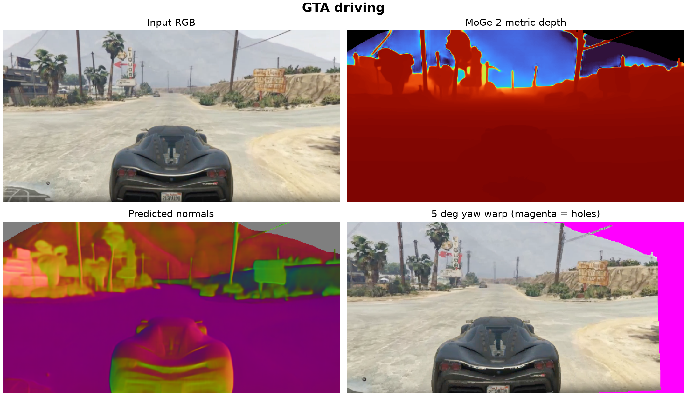
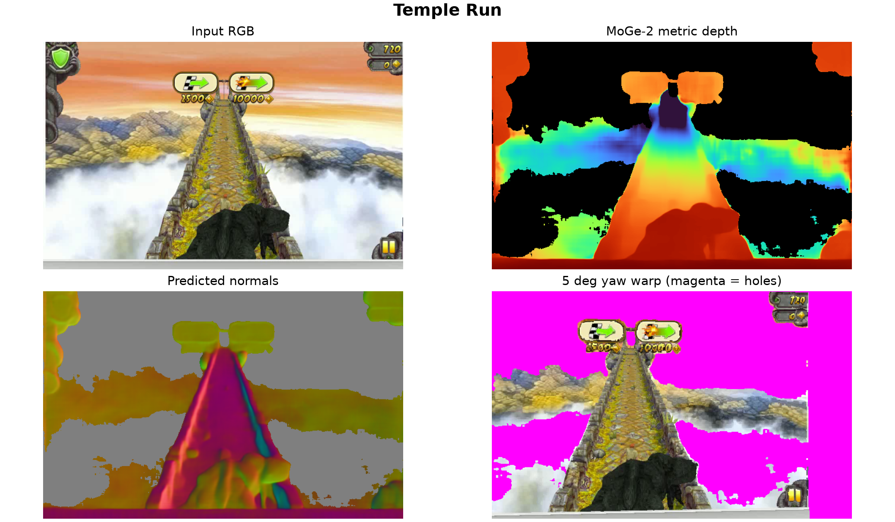
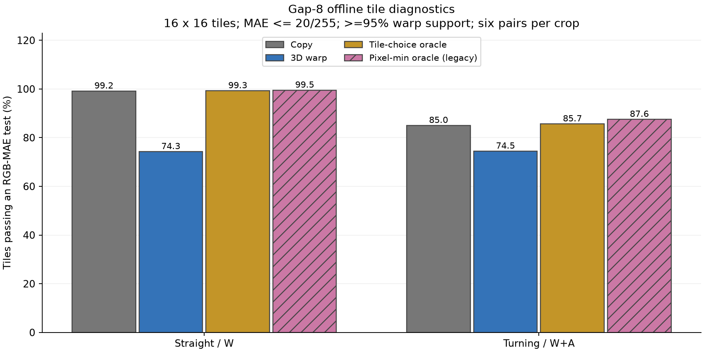

# 实验结果与发现

## 技术摘要

几何提取和 GPU 重投影链路已在本机运行。组件优化有效，但固定使用几何 Warp 的质量不优于简单 Copy；真正需要验证的是按需启用几何的增量收益。以下所有“已测”均指 2026-08-16 的记录；2026-08-28 只做整理、重新聚合、指标校正和代码验证。

## E1：单帧几何

硬件：RTX 4060 Laptop 8 GB / Windows；MoGe-2 ViT-S Normal，FP16 推理，最长边 640，num_tokens=1200。模型驻留后 warmup=1、repeat=3；样本很少，不能给出稳健的 p95。模型加载与文件读写不在推理计时内。

| 样本 | 单次测量 ms | 均值 ms | 中位数 ms | PyTorch peak allocated MB | 有效区域 |
|---|---|---:|---:|---:|---:|
| GTA | 58.606 / 57.794 / 58.720 | 58.373 | 58.606 | 497.0 | 96.30% |
| Temple Run | 59.302 / 59.654 / 58.105 | 59.020 | 59.302 | 503.2 | 49.55% |
| Universal | 60.385 / 59.143 / 60.531 | 60.020 | 60.385 | 488.6 | 79.56% |

原始记录见 [results/recorded](../results/recorded)。显存是 PyTorch allocated 峰值，不包含全部驱动/桌面开销。有效区域不是深度准确率；没有引擎深度真值。

GTA 的点图和深度可用于投影，但人物/车体、HUD、遮挡与远景仍然是风险点。

Temple Run 的有效几何比例较低；不能因为图像有像素就假定都有可靠可复用几何。

## E2：合成目标相机与 CUDA Warp

固定前移 0.10 预测尺度单位，splat 半径 1；没有目标 RGB 真值，因此只能讨论支持区域。

| 场景 | yaw 2° 覆盖 | yaw 5° 覆盖 | yaw 10° 覆盖 |
|---|---:|---:|---:|
| GTA | 93.98% | 88.97% | 80.98% |
| Temple Run | 48.16% | 45.85% | 41.11% |
| Universal | 76.73% | 70.87% | 62.33% |

GTA yaw5：CPU warmup=2/repeat=10，中位 212.207 ms；CUDA warmup=10/repeat=50，中位 3.693 ms；H2D+CUDA 4.052 ms。GPU 计时同步等待完成，不含 D2H、保存图像、呈现屏幕和模型几何前端。

对原始数组复核，CPU/CUDA mask IoU=1.0，深度差为 0，RGB 平均绝对差在覆盖区域约 0.191/255、全图约 0.170/255。这是当前样本对照，不保证所有场景完全一致。CUDA 颜色采用近似等深选择。

Universal 的 H2D+CUDA 中位数 3.519 ms 小于驻留测得 4.479 ms，说明顺序、频率和噪声会影响小内核计时；不能解释为传输提高了速度。

## E3：Active-query 代理微基准

大代理：4,096 tokens、width 768、12 heads、12 blocks、MLP ratio 4、BF16；warmup 3 rounds、repeat 15、inner=1、preheat=12。小代理：2,048 tokens、width 512、8 heads、8 blocks、warmup=5、repeat=20、inner=3、preheat=80。

每轮用固定随机顺序交错 active ratios，减小 GPU 升频顺序偏差。K/V 已预计算，Q 和 MLP 随 active tokens 减少；没有训练后的生成质量。

| Active Q | 大代理中位 ms | 大代理 p95 ms | 小代理中位 ms |
|---:|---:|---:|---:|
| 100% | 47.536 | 48.510 | 7.475 |
| 75% | 36.001 | 37.033 | 7.029 |
| 50% | 24.284 | 24.596 | 7.000 |
| 25% | 12.877 | 13.839 | 7.975 |
| 12.5% | 11.351 | 13.921 | 7.903 |
| 6.25% | 未测 | 未测 | 7.855 |

观察支持“较大的计算负载可能从 packed Q 获益”；小代理的负结果说明不能用 token 比例直接推导加速倍率。

## E4：真实未来 RGB 的离线对照

数据是 Matrix-Game 2 **官方演示视频**中的两个 GTA 区域，不是本机生成，也不是引擎真值。原始视频 30 FPS，裁剪 654×300，缩放至 640×294。两个短而相关的轨迹不代表 59 个独立场景。

| 分组 | Straight | Turning | 帧间隔 |
|---|---:|---:|---|
| short | 13 | 13 | 3 / 6 |
| gap8 | 6 | 6 | 8 |
| long | 11 | 10 | 15 / 30 |

有效 59 对；Turning 15→45 因 PnP 中位残差约 825.85 px 被拒绝。旧的未提取目标帧未纳入计数，不等同于运行成功；新评估脚本显式记录 skipped。

原始 short 结果：

| 裁剪 | Copy PSNR | Warp PSNR | Warp 比 Copy 更好的覆盖像素 |
|---|---:|---:|---:|
| Straight | 29.40 dB | 24.91 dB | 18.17% |
| Turning | 24.71 dB | 22.94 dB | 30.33% |

排除 target frame≥90 的转场风险对后，short 每轨迹 12 对：Straight 30.15 vs 24.96 dB；Turning 25.44 vs 22.86 dB。这个过滤是发布审计中的事后敏感性分析，不是预注册测试集。

Gap8 的 20/255 tile 阈值：

| 裁剪 | Copy | Warp | 真正逐块候选 Oracle | 旧逐像素 min Oracle |
|---|---:|---:|---:|---:|
| Straight | 99.189% | 74.298% | 99.298% | 99.539% |
| Turning | 85.044% | 74.496% | 85.680% | 87.566% |

真正的逐块 Oracle 只比 Copy 多约 0.11 / 0.64 个百分点，不应把更宽松的逐像素 Oracle 当成能实现的块路由收益。两种 Oracle 都偷看目标，只提供诊断。

更多阈值、帧间隔与逐对记录见 [完整表格](../results/audited/TABLES.md)、[逐对 JSON](../results/audited/quality_pairs.json)。

## E5：耗时账本，不是新模型运行结果

大代理完整四次调用为 190.144 ms。旧版 Straight Copy 的 7.22× 依赖 12.5% 以下向 0 延迟线性外推；改为保持最小实测点延迟的 floor 敏感性设定后，为约 2.99×。**两者都是假设账本，不能作为真实加速成绩。**

| 路由（floor 假设） | Straight 估算 ms / 倍率 | Turning 估算 ms / 倍率 |
|---|---:|---:|
| Copy + 4-step proxy | 63.497 / 2.995× | 64.546 / 2.946× |
| Warp + 4-step proxy | 80.515 / 2.362× | 80.200 / 2.371× |
| 逐块 Copy/Warp Oracle + proxy | 74.054 / 2.568× | 74.831 / 2.541× |

K=8，阈值 20/255；Warp/Oracle 支付 58.606 ms/周期几何费和 3.693 ms/非 anchor 帧 Warp 费。这里的合成相机 Warp 耗时也不是逐个真实帧对重新 profile 的值。完整假设见 [METHOD](METHOD.md)。

最终判断：当前数据并不支持“引入 3D 后优于 Copy 的端到端收益已为正”。仍有组件级机会，下一步应采集干净 action/pose 数据并接入真实模型。
