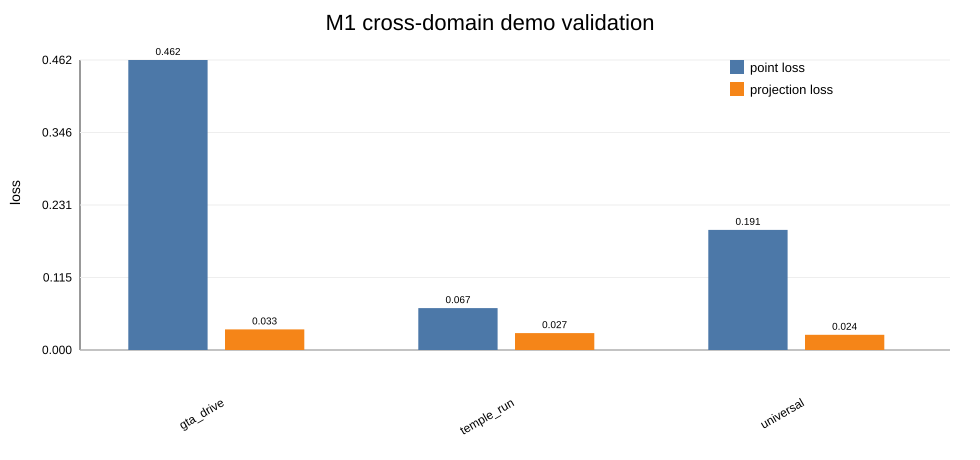
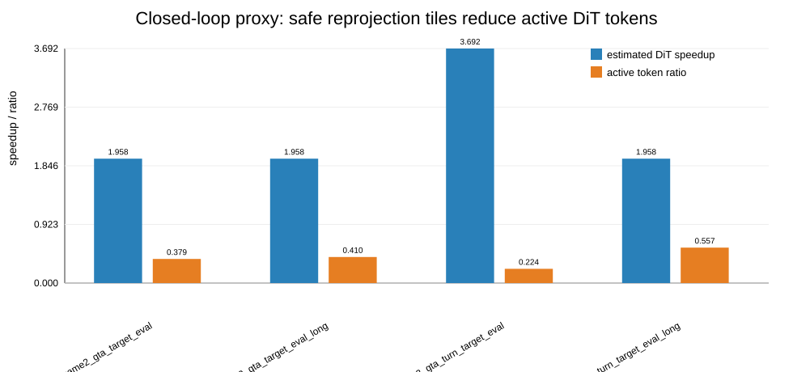

# M1：3D 轻量几何模型导师交付报告

日期：2026-08-31  
仓库：`kudoumoon/3D-light-model`  
本报告基于仓库当前代码、文档和已归档实验结果整理。写作时保留证据边界：M1 已形成可交付的几何模块原型和实验链路，但还不能把 proxy 结果写成完整下游端到端结论。

## M1:3D 轻量几何模型

M1 的任务是给后续重投影模块提供低延迟、可筛选的 3D 信息。输入是单帧 RGB，输出包括 point map、depth、valid mask、normal、camera intrinsics，以及给定运动条件下的 warp confidence。下游同学可以直接使用 point map 做 camera transform 和 forward splatting，再用 warp confidence 判断哪些区域适合复用，哪些区域应交给 DiT/refiner 重新生成。

当前建议交付两个 checkpoint：

| 用途 | checkpoint | 说明 |
|---|---|---|
| 基础几何输出 | `runs/reprojection_student/student_video384_tvod_v7_2k_occ075_width64_lr15/checkpoints/best.pt` | 主几何模型，速度和 coverage utility 最均衡 |
| 运动条件置信度 | `runs/reprojection_student/student_video384_tvod_v10_frozengeom_motionconf_width64_lr1e4/checkpoints/best.pt` | 冻结 v7 几何，只训练 motion confidence head |

一句话结论：M1 不是单纯把 MoGe-3 蒸馏成小模型，而是把几何预测改成重投影可用性预测。它的交付物是 point map + motion-conditioned confidence，而不是最终视频帧。

## 技术路线:

技术链路分为四步。

第一步，使用 MoGe-3 作为离线 teacher。对 Matrix-Game 2/3 的视频帧导出统一 `geometry.npz`，其中包含 RGB、point map、depth、valid mask、normal 和 intrinsics。MoGe-3 不进入在线推理路径，只提供伪标签和评估参照。

第二步，训练轻量 CNN student。student 输入 RGB，输出 dense point map、source valid mask、normal 和 warp logits。基础损失包含 point smooth L1、mask BCE、normal cosine、depth-gradient，以及 projection loss。这里的 projection loss 不是普通深度监督，它把 teacher/student point map 通过虚拟相机运动投到目标视角，再比较投影坐标误差。

第三步，加入 Target-View Occupancy Distillation（TVOD）。训练时把 teacher/student 的 projected coordinates splat 到 target view，得到 occupancy grid，并蒸馏学生的 target-view coverage。TVOD 解决的问题是：source-view 几何误差低，并不保证 target view 没有 holes。M1 的训练目标因此直接面向重投影覆盖率。

第四步，训练 motion-conditioned warp confidence。M1-v10 冻结 v7 几何主干，只训练 38,273 个 motion head 参数；冻结参数为 3,067,271。给定 yaw/forward 等目标运动后，head 预测每个 source pixel 在该运动下是否 projected-valid。这个设计把“几何坐标预测”和“下游是否安全复用”分开，避免 joint fine-tuning 为了提高 confidence 而破坏几何覆盖。

## 可行性实验结果：

### 1. MoGe-3 teacher 与学生模型速度

| 模型/路径 | 延迟口径 | latency | 相对 MoGe-3 speedup | 备注 |
|---|---:|---:|---:|---|
| MoGe-3 teacher | mean excluding first sample | 25.263 ms | 1.00x | 离线 teacher，不作为在线路径 |
| M1-v7 geometry-only | median | 7.594 ms | 3.33x | 主几何模型 |
| M1-v10 single-motion confidence retest | median | 10.558 ms | 2.39x | 包含 motion confidence |
| M1-v10 full eval recorded | median | 19.567 ms | 1.29x | 记录版全评估路径，包含更多输出/评测开销 |

v7 的几何速度收益是明确的。v10 加入 confidence head 后仍有正收益，但在线系统如果只需要 point map，可走 v7；如果要做区域筛选，应走 v10。

### 2. 几何与置信度指标

| 模型 | loss | point | projection | coverage gap mean | coverage gap min | AUC_global | ECE | thr=0.8 kept | thr=0.8 projected-valid |
|---|---:|---:|---:|---:|---:|---:|---:|---:|---:|
| v7 TVOD geometry | 0.1622 | 0.00528 | 0.01042 | -0.05765 | -0.20012 | 0.8139 | 0.0624 | 0.6707 | 0.9017 |
| v10 frozen-geometry confidence | 0.2206 | 0.00528 | 0.01054 | -0.05765 | -0.20012 | 0.9525 | 0.0221 | 0.7489 | 0.9597 |

v10 的主要收益不在 point loss，而在可靠性判断。冻结几何后，coverage gap 没有被 confidence 训练拉坏；AUC 从 0.8139 提升到 0.9525，ECE 从 0.0624 降到 0.0221。threshold=0.8 时，v10 保留 74.89% 像素，其中 projected-valid rate 为 95.97%。这对下游重投影很关键，因为它降低了错误 warp 被接受的概率。

### 3. 候选模型选择

| 候选 | eval loss | point | projection | inference ms | coverage gap | yaw10 gap | worst gap | speedup | coverage ratio | SUP |
|---|---:|---:|---:|---:|---:|---:|---:|---:|---:|---:|
| occ075_width80 | 0.1497 | 0.00440 | 0.00901 | 10.47 | -0.0713 | -0.0650 | -0.1975 | 2.41x | 0.914 | 2.21 |
| occ05_width80 | 0.1521 | 0.00468 | 0.00942 | 10.47 | -0.0549 | -0.0486 | -0.2137 | 2.41x | 0.934 | 2.25 |
| occ075_width64_lr15 | 0.1622 | 0.00528 | 0.01042 | 7.59 | -0.0577 | -0.0515 | -0.2001 | 3.33x | 0.931 | 3.10 |

SUP 定义为 `geometry speedup × coverage utility ratio`。主模型选择 `occ075_width64_lr15`，原因是 SUP 最高。它不是 loss 最低的模型，但在论文目标下更合适：我们需要的是可用于重投影的低延迟几何，而不是单项 loss 最小。

### 4. Hard-case 结果

v10 的 hard-case 评估覆盖 120 个 motion case。平均 coverage gap 为 -0.05765，最差为 -0.20012。主要问题集中在 `game2_mid_left` 和 `game3_left`。

| scene | cases | student coverage | teacher coverage | mean gap | min gap |
|---|---:|---:|---:|---:|---:|
| game2_mid_left | 12 | 0.7191 | 0.8296 | -0.1104 | -0.2001 |
| game3_left | 12 | 0.7687 | 0.8534 | -0.0848 | -0.1316 |
| game2_right | 12 | 0.7538 | 0.8337 | -0.0799 | -0.1131 |
| game2_center | 12 | 0.7658 | 0.8348 | -0.0691 | -0.0844 |
| game3_right | 12 | 0.8469 | 0.8563 | -0.0095 | -0.0249 |

这组结果说明 M1 可以稳定提供几何信息，但遮挡边界、薄结构和较大运动仍会造成 target-view holes。它也是下一步优化最明确的入口。

## 泛化性：适用场景

当前训练数据来自 Matrix-Game-2/3 视频，多 crop 抽帧，共 1880 个 teacher frames，validation 为 375 个样本。这个规模已经能支撑游戏/合成视频域内的几何蒸馏，但还不足以证明真实世界泛化。

现有跨域 demo 覆盖 GTA、Temple Run、Universal 三类示例，共 5 个样本。结果只能作为 smoke test，不能作为论文级泛化结论。

| scene | samples | loss | point | projection | median inference |
|---|---:|---:|---:|---:|---:|
| gta_drive | 1 | 0.6161 | 0.4618 | 0.0329 | 2.034 ms |
| temple_run | 1 | 0.1903 | 0.0667 | 0.0268 | 2.235 ms |
| universal | 3 | 0.3128 | 0.1913 | 0.0242 | 2.037 ms |

从适用场景上看，M1 当前更适合：

- 游戏、驾驶、街景、跑酷类连续视频，尤其是相机运动主导、场景结构相对连续的片段。
- 中小视角变化下的 forward reprojection，包括 yaw ±5°/±10°、小幅 forward motion。
- 需要把昂贵 DiT 生成集中到不可信区域的系统，例如 active token / tile routing。
- 离线 teacher 可用、在线端需要低延迟 point map 的 pipeline。

不应过度声称的场景包括：大 baseline 新视角、强非刚体运动、透明/反光物体、快速遮挡切换、严重 motion blur、真实世界复杂动态数据集。这里需要继续补跨域验证，每域至少 30 个样本，最好覆盖 indoor/outdoor、real video 和强动态物体。

## 速度收益比:

M1 的速度收益应分两层报告。

第一层是几何模块自身。MoGe-3 teacher 为 25.263 ms，M1-v7 geometry-only 为 7.594 ms，对应 3.33x speedup。M1-v10 单 motion confidence retest 为 10.558 ms，对应 2.39x speedup。这个收益可以作为 M1 模块的直接结论。

第二层是下游 active-DiT proxy。当前 benchmark 运行在 `NVIDIA GeForce RTX 4060 Laptop GPU`，tokens=4096，不是 H100，也不是完整 Matrix-Game 端到端。结果如下：

| active ratio | median latency | speedup vs full |
|---:|---:|---:|
| 1.000 | 47.536 ms | 1.00x |
| 0.750 | 36.001 ms | 1.32x |
| 0.500 | 24.284 ms | 1.96x |
| 0.250 | 12.877 ms | 3.69x |
| 0.125 | 11.351 ms | 4.19x |

高运动片段的 closed-loop proxy 显示，safe tile 可以把 active ratio 降到 0.224–0.557，对应最近邻 active-DiT speedup 为 1.96x–3.69x。`matrix_game2_gta_turn_target_eval` 的 high-motion split 有 6 对样本，safe_tile_fraction 为 0.7757，estimated_active_ratio 为 0.2243，最近邻 speedup 为 3.69x，warp_better_than_copy_fraction 为 0.4621。

严格表述：M1 已证明几何模块本身有正速度收益，并给出了下游 token 减少的 proxy 证据；完整 gated-DiT 端到端收益还需要后续模块接入后实测。

## 不足,遇到的问题：：

当前主要不足有四类。

第一，跨域验证不足。已有跨域 demo 只有 5 个样本，无法支撑“强泛化”的论文结论。正式实验需要按域分层，至少覆盖游戏域外真实视频、室内外、动态物体和低纹理区域。

第二，hard-case coverage gap 仍明显。最差 case 为 -0.20012，说明学生在部分遮挡边界和目标视角覆盖上仍漏点。继续简单堆 epoch 不一定解决问题，应优先做 hard-case mining、depth-edge-aware 训练和 coverage-deficit 消融。

第三，下游闭环仍是 proxy。active-DiT benchmark 证明少算 token 可以更快，但它不是 Matrix-Game 权重，也不是完整 renderer。论文中必须把它标成 proxy，不能写成端到端系统加速。

第四，v10 有额外延迟。motion confidence head 带来可靠性收益，但单 motion retest 从 7.594 ms 增加到 10.558 ms。后续可以做 motion batch、head 轻量化或缓存策略，把 v10 压回 8–9 ms 区间。

## 可能会被喷的点:

1. “这只是 MoGe-3 蒸馏。”回应方式：强调 M1 的训练目标不是普通几何拟合，而是 projection loss、TVOD、motion-conditioned confidence 和 hard-case coverage repair。需要用消融表证明这些项带来重投影指标收益。
2. “Copy baseline 已经很强。”回应方式：按 low-motion/high-motion 分层。低运动时 copy 确实强，M1 的作用是 gating，避免错误 warp；高运动时 warp_better_than_copy_fraction 明显上升，才是几何复用的主要价值区间。
3. “泛化性证据不够。”这是事实。当前报告只能写已有训练域和 demo 泛化，不能声称跨真实世界稳健。需要补真实视频和更多数据集。
4. “速度收益不是端到端。”这是事实。几何模块 speedup 是实测，active-DiT 是 proxy。正式论文必须补 gated-DiT 或接近端到端的 ablation。
5. “单目几何尺度不稳定。”M1 通过 projection/occupancy/confidence 降低影响，但不能完全消除尺度问题。论文里应把它作为适用边界，并用 confidence calibration 说明错误区域可被筛出。

## 创新性：

M1 的创新点建议写成三条，避免把 MoGe-3 teacher 本身当贡献。

第一，重投影导向的几何蒸馏。M1 不只蒸馏 source-view point map，还把投影坐标和 target-view occupancy 纳入训练。这个目标与下游实际需求一致：重投影关心目标视角覆盖、holes 和错误遮挡。

第二，motion-conditioned warp confidence。同一像素在不同相机运动下可复用性不同。M1-v10 用目标运动作为条件预测 projected-valid probability，为下游 active tile/token routing 提供直接信号。这个信号比静态 depth confidence 更贴近交互式世界模型。

第三，hard-case coverage repair 的训练方向。coverage-deficit loss 只惩罚学生比 teacher 少覆盖的目标区域；depth-edge-aware point loss 强化遮挡边界和深度突变处的几何精度。该方向已接入实验设计，但仍需要完整训练和消融才能作为正式主贡献写入论文。

如果按 A 会标准审稿，我会把当前 M1 评为约 84/100。它已经有清楚的技术路线、可复现实验和一个有论文潜力的创新点，但泛化规模、hard-case 修复和端到端收益还没有闭合到 90+。

## method 正文：

### Problem formulation

给定一帧源图像 $I_s \in \mathbb{R}^{H \times W \times 3}$ 和目标相机运动 $a$，M1 预测源视角几何 $G_s$ 与运动条件重投影置信度 $C_a$。$G_s$ 包括 camera-space point map $P_s \in \mathbb{R}^{H \times W \times 3}$、深度 $D_s$、有效掩码 $M_s$、法向 $N_s$ 和相机内参 $K$。$C_a \in [0,1]^{H \times W}$ 表示每个 source pixel 在运动 $a$ 下能否安全进入 target view。下游模块使用 $P_s$ 做刚体变换和 forward splatting，并用 $C_a$ 决定区域复用或重新生成。

### Offline geometry teacher

我们使用 MoGe-3 作为离线几何教师。对训练视频帧，teacher 导出 `geometry.npz`，其中保存 RGB、point map、depth、valid mask、normal 和 intrinsics。所有训练、评估和重投影脚本读取同一数据格式，减少实验间的接口漂移。在线推理阶段不调用 MoGe-3，因此 teacher 的推理时间只作为上界 baseline 和蒸馏参照。

该设置的目标不是复制 teacher 的全部能力，而是把开放场景几何先验压缩成一个低延迟接口。由于下游任务是重投影，student 不能只优化源视角几何误差。一个像素的 point error 在 source view 中可能很小，但经过相机运动后会造成 target-view holes 或遮挡错位。因此，我们把投影误差和目标视角覆盖率纳入训练目标。

### Lightweight geometry student

学生模型采用轻量 CNN encoder-decoder。输入为 RGB，输出 point map、valid logits、normal 和 warp logits。设 teacher point map 为 $P^T$，student point map 为 $P^S$，teacher valid mask 为 $M^T$。基础 point loss 为

$$
\mathcal{L}_{point}=\frac{1}{|M^T|}\sum_{u \in M^T}\rho(P^S_u-P^T_u),
$$

其中 $\rho$ 为 smooth L1 loss。valid mask 使用 binary cross entropy 监督，normal 使用余弦方向损失，depth-gradient loss 约束局部深度边缘。depth-gradient 项主要用于降低边界过平滑，因为边界误差会在 forward splatting 后被放大。

### Reprojection-oriented supervision

为使几何输出直接服务于重投影，我们在训练中采样虚拟相机运动 $a$，并把 teacher/student point map 投影到同一目标视角。令 $\Pi_a(\cdot)$ 表示由 $a$ 和内参 $K$ 定义的投影函数，projection loss 为

$$
\mathcal{L}_{proj}=\frac{1}{|M^T|}\sum_{u \in M^T}\rho(\Pi_a(P^S_u)-\Pi_a(P^T_u)).
$$

随后把 projected coordinates splat 到 target view，得到 teacher occupancy $O^T_a$ 和 student occupancy $O^S_a$。TVOD 使用 smooth L1 蒸馏二者：

$$
\mathcal{L}_{occ}=\rho(O^S_a,O^T_a).
$$

这一步把训练目标从“源视角几何接近 teacher”推进到“目标视角覆盖行为接近 teacher”。在重投影任务中，这比单纯追求 depth 或 point regression 更直接。

### Motion-conditioned warp confidence

M1-v10 在 v7 几何基础上训练 motion-conditioned confidence。训练时冻结几何主干，只更新 motion head。给定目标运动 $a$，head 输出 $C_a$，预测 source pixel 是否 projected-valid。监督标签 $V^T_a$ 来自 teacher 几何在同一运动下的 projected-valid mask，损失为

$$
\mathcal{L}_{conf}=\mathrm{BCE}(C_a,V^T_a).
$$

这个 head 解决的是静态 confidence 难以处理的问题：同一个点在小幅 yaw 下可能可复用，在较大 yaw 或 forward motion 下可能离开视野或落在遮挡边界。把 motion 显式输入 confidence head 后，下游可以按当前 action 选择安全区域，而不是用固定几何阈值处理所有运动。

### Hard-case coverage repair

现有 v10 的最差 coverage gap 接近 -0.20，说明部分样本仍存在明显漏覆盖。我们将 hard-case 修复写入训练目标，而不是依赖后处理规则。coverage-deficit loss 只惩罚 student coverage 小于 teacher coverage 的区域：

$$
\mathcal{L}_{deficit}=\mathrm{ReLU}(O^T_a-O^S_a).
$$

同时，depth-edge-aware point loss 根据 teacher depth discontinuity 提高边界像素权重：

$$
\mathcal{L}_{edge\text{-}point}=\frac{1}{|M^T|}\sum_{u \in M^T}w(D^T_u)\rho(P^S_u-P^T_u).
$$

这两个目标都直接针对重投影失败模式。coverage-deficit 关注 target-view holes，depth-edge-aware loss 关注遮挡边界和薄结构。正式论文中需要通过 v11 消融报告它们是否改善 worst-case gap，以及是否带来 point/projection loss 或 latency 代价。

### Overall objective and downstream interface

基础几何阶段优化

$$
\mathcal{L}_{M1}=\lambda_p\mathcal{L}_{point}+\lambda_m\mathcal{L}_{mask}+\lambda_n\mathcal{L}_{normal}+\lambda_g\mathcal{L}_{grad}+\lambda_{proj}\mathcal{L}_{proj}+\lambda_{occ}\mathcal{L}_{occ}.
$$

hard-case 变体额外加入 $\lambda_d\mathcal{L}_{deficit}$ 和 $\lambda_e\mathcal{L}_{edge\text{-}point}$。第二阶段固定几何，只优化 $\mathcal{L}_{conf}$。M1 的输出不会直接替代生成模型，而是给下游提供几何重投影和计算分配信号。高置信区域可直接 warp 或低成本修复；低置信区域、disocclusion、动态物体和遮挡边界交给更重的生成路径。

## 实验图与证据索引

| 类型 | 路径 |
|---|---|
| 技术路线图 | `results/recorded/m1_v10_frozen_geometry_motion_confidence/figures/m1_method_route.png` |
| 指标对比图 | `results/recorded/m1_v10_frozen_geometry_motion_confidence/figures/m1_metric_comparison.png` |
| 置信度阈值曲线 | `results/recorded/m1_v10_frozen_geometry_motion_confidence/figures/m1_confidence_threshold_curve.png` |
| 速度权衡图 | `results/recorded/m1_v10_frozen_geometry_motion_confidence/figures/m1_latency_tradeoff.png` |
| coverage by scene | `results/recorded/m1_v10_frozen_geometry_motion_confidence/figures/m1_v10_coverage_by_scene.png` |
| 跨域 demo 图 | `results/recorded/m1_v11_completion_pack/figures/m1_cross_domain_demo_validation.svg` |
| hard-case 图 | `results/recorded/m1_v11_completion_pack/figures/m1_hardcase_coverage_gap.svg` |
| 下游 proxy 图 | `results/recorded/m1_v11_completion_pack/figures/m1_closed_loop_proxy_speedup.svg` |
| v10 总结 JSON | `results/recorded/m1_v10_frozen_geometry_motion_confidence/m1_v10_recorded_summary.json` |
| completion pack | `results/recorded/m1_v11_completion_pack/M1_COMPLETION_EXPERIMENT_PACK.md` |

## 给导师看的最终口径

M1 当前可以作为论文中的 3D 信息模块交付。它提供低延迟 point map 和 motion-conditioned warp confidence，能支撑后续重投影模块做区域复用和 active token routing。已有实验证明：相对 MoGe-3 teacher，基础几何路径有 3.33x speedup；加入 motion confidence 后仍有 2.39x speedup；v10 在不破坏 coverage 的前提下把 confidence AUC 提升到 0.9525，ECE 降到 0.0221。现有结果支持“重投影友好型几何模块”的技术路线。

但正式论文还需要补两类关键证据：更大规模跨域验证，以及接入下游后的端到端收益。当前 closed-loop 结果应写成 proxy。hard-case 修复已经有清楚训练方向，但还需要完整消融确认收益。若后续实验能把 worst-case coverage gap 从 -0.20 拉回，并证明 gated-DiT 的真实速度/质量收益，M1 才能更稳地支撑 A 会级别主张。
