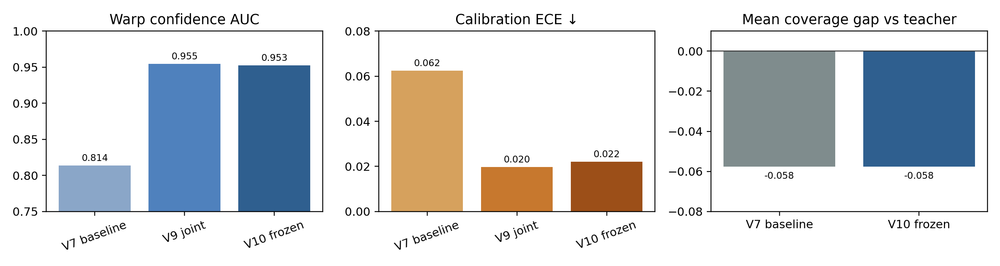
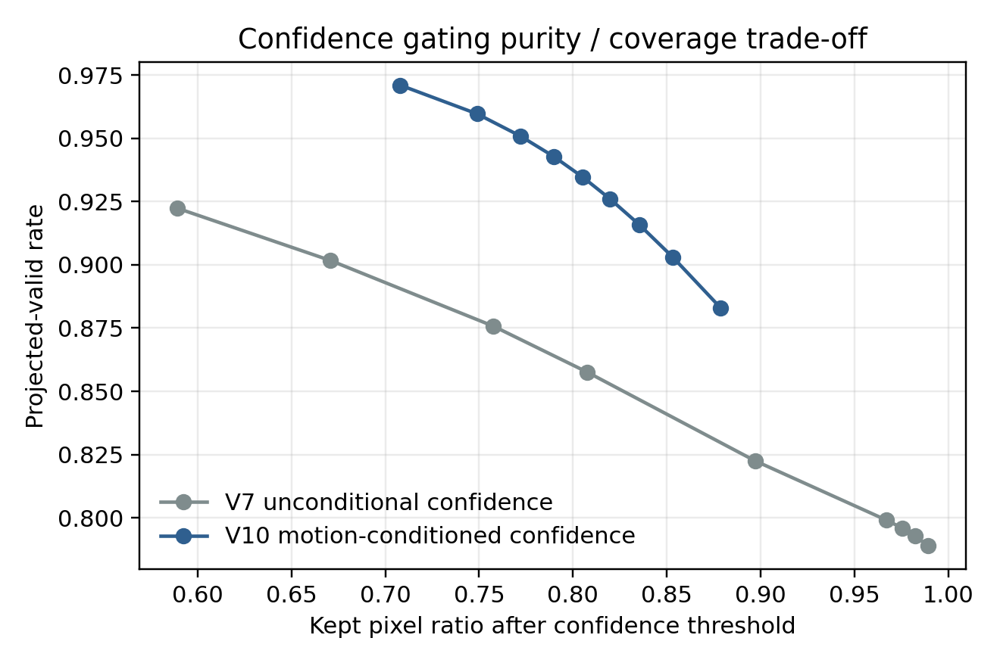
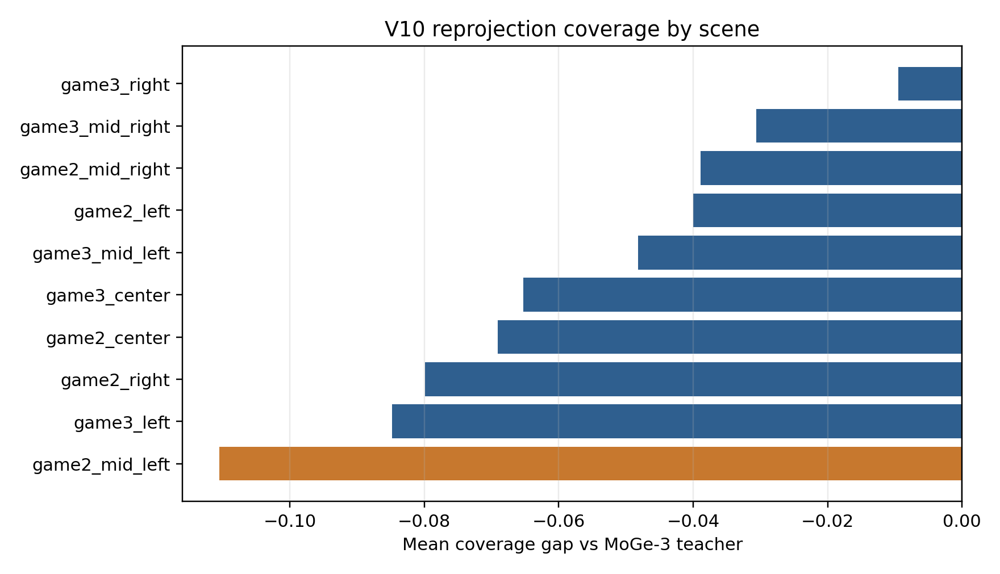
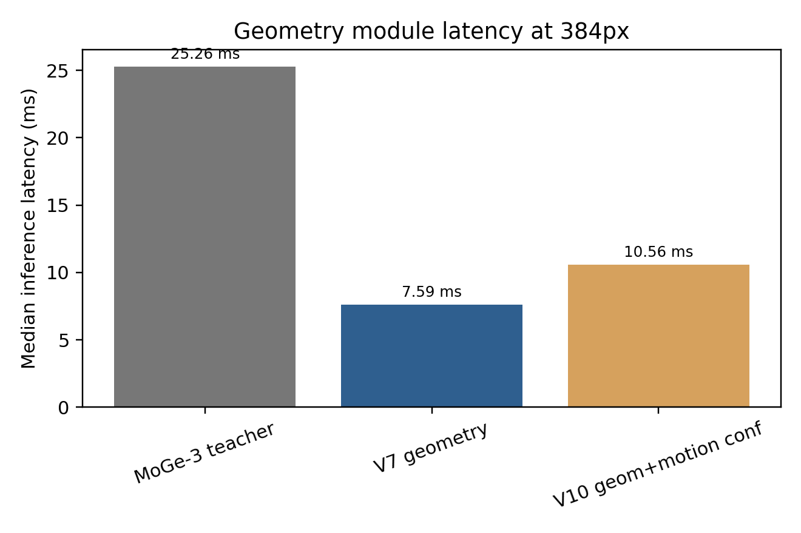
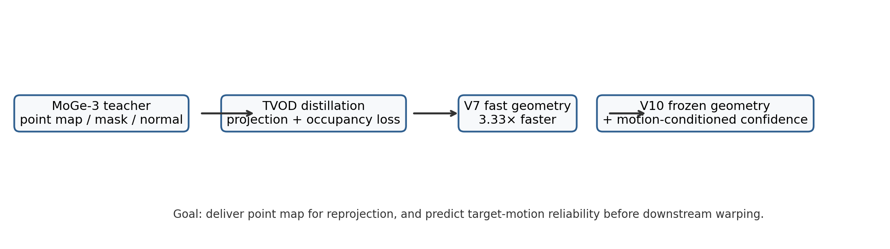

# M1 3D 几何模块阶段技术报告：V10 Frozen-Geometry Motion Confidence

## 技术结论

当前最稳妥的可交付模型不是联合微调后的 v9，而是 **M1-v10：冻结 v7 几何主干 + 训练 motion-conditioned confidence head**。

- **几何输出保持 v7 水平**：point loss=0.005281，projection loss=0.010543，mean coverage gap=-0.057653，worst gap=-0.200120。这与 v7 baseline 的 mean gap=-0.057653、worst gap=-0.200120 对齐。
- **可靠性预测显著增强**：v7 AUC=0.8139 / ECE=0.0624；v10 AUC=0.9525 / ECE=0.0221。这说明 v10 更适合下游重投影前做像素筛选、置信度 gating 和失败区域规避。
- **速度收益仍为正**：v7 几何-only 推理 7.59ms，相对 MoGe-3 teacher 25.26ms 为 3.33× 加速；v10 含单 motion confidence 复测中位 10.56ms，仍有 2.39× 加速，但比 v7 多约 39.0% 开销。
- **不能宣称已达到 A 会 oral 标准**：当前我给 M1 阶段约 84/100。主要短板是跨数据集验证不足、hard-case coverage gap 仍到 -0.20、尚无下游 DiT/reprojection 闭环收益。

## 关键实验发现与图表证据

这张图展示 v10 的核心收益：在 coverage 不退化的前提下，warp confidence 的 AUC 从 v7 的 0.8139 提升到 0.9525，ECE 从 0.0624 降到 0.0221。

threshold=0.8 时，v7 保留 0.671 像素、projected-valid rate=0.902；v10 保留 0.749 像素、projected-valid rate=0.960。v10 的目标不是让所有点都更满，而是让下游更容易知道哪些点能安全重投影。

coverage 的主要失败集中在 `game2_mid_left`，mean gap=-0.1104，worst gap=-0.2001。这说明 hard-case 仍需 patch/motion-aware 几何增强，而不是继续简单扩大 epoch。

v10 的 confidence head 带来额外开销，但整体仍快于 MoGe-3 teacher。若下游只需要 point map，可走 v7 geometry-only；若需要重投影前可靠性 gating，则走 v10。

## 方法定义

M1 当前由两层组成：

1. **TVOD 几何 student（v7）**：以 MoGe-3 teacher 导出的 `point map / depth / mask / normal / intrinsics` 为监督，训练轻量 CNN student。核心目标是快速输出可重投影的 3D 几何。
2. **Motion-conditioned confidence（v10）**：从目标相机运动 `(yaw, forward)` 编码出条件，预测该 motion 下每个 source pixel 是否能有效投影到 target view。v10 冻结 v7 几何参数，只训练 38,273 个 motion head 参数，避免几何 coverage 被 confidence loss 拉坏。

## 为什么不选择 v9 联合微调

v9 联合微调能把 confidence 做到 AUC=0.9547、ECE=0.0198，但中途重投影检查发现裸 geometry coverage 出现 -0.20 量级退化。对 M1 来说，point map 稳定性优先级高于单独 confidence 指标，因此 v9 不作为主交付模型，只作为证明 motion-conditioned confidence 可行的 ablation。

## 当前可交付内容

- 主几何 checkpoint：`runs/reprojection_student/student_video384_tvod_v7_2k_occ075_width64_lr15/checkpoints/best.pt`
- v10 confidence checkpoint：`runs/reprojection_student/student_video384_tvod_v10_frozengeom_motionconf_width64_lr1e4/checkpoints/best.pt`
- 标准输出 contract：`points`, `depth`, `mask`, `source_confidence`, `warp_confidence`, `normal`, `rgb`, `intrinsics`, `warp_confidence_yaw_p5_fwd10`, `warp_confidence_yaw_m5_fwd10`, `warp_confidence_yaw_p10_fwd10`, `warp_confidence_yaw_m10_fwd10`
- 记录版结果：`results/recorded/m1_v10_frozen_geometry_motion_confidence/`

## A 会标准差距

当前还不能宣布 M1 已达 A 会 oral 水平。要接近 90+/100，至少需要补：

1. **跨数据集泛化**：真实视频/室内外/动态物体/非游戏数据集验证。
2. **hard-case coverage 修复**：针对 `game2_mid_left frame_000300` 这类样本做 patch-level 或 depth-discontinuity-aware distillation。
3. **下游闭环收益**：把 v10 confidence 交给重投影同学，实测 DiT token/step 节省、重投影 PSNR/LPIPS/FVD 或最终生成质量收益。
4. **速度优化**：motion confidence head 需要 batch motion 或轻量化，目标把 v10 从 10.56ms 压到 8–9ms。
